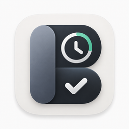
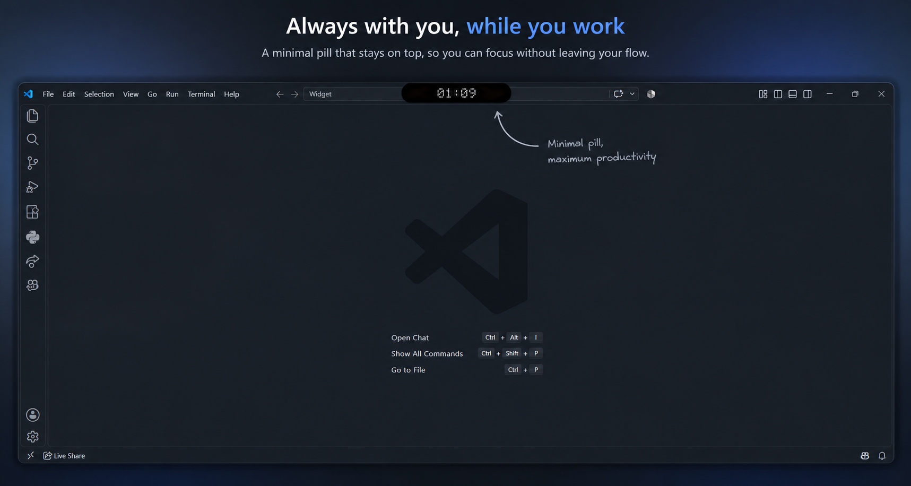
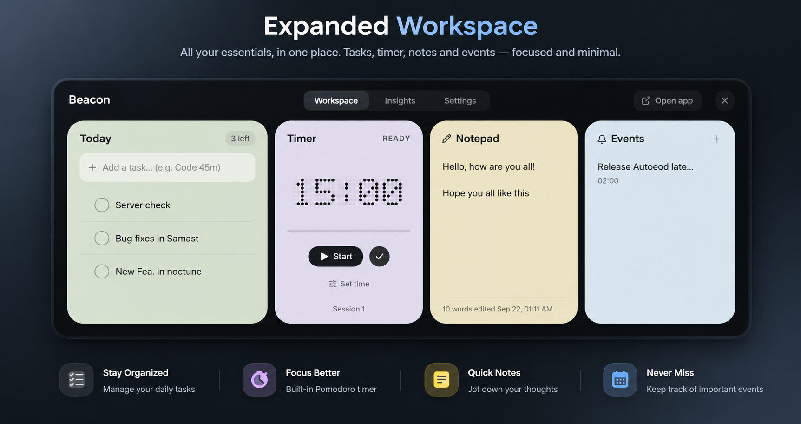
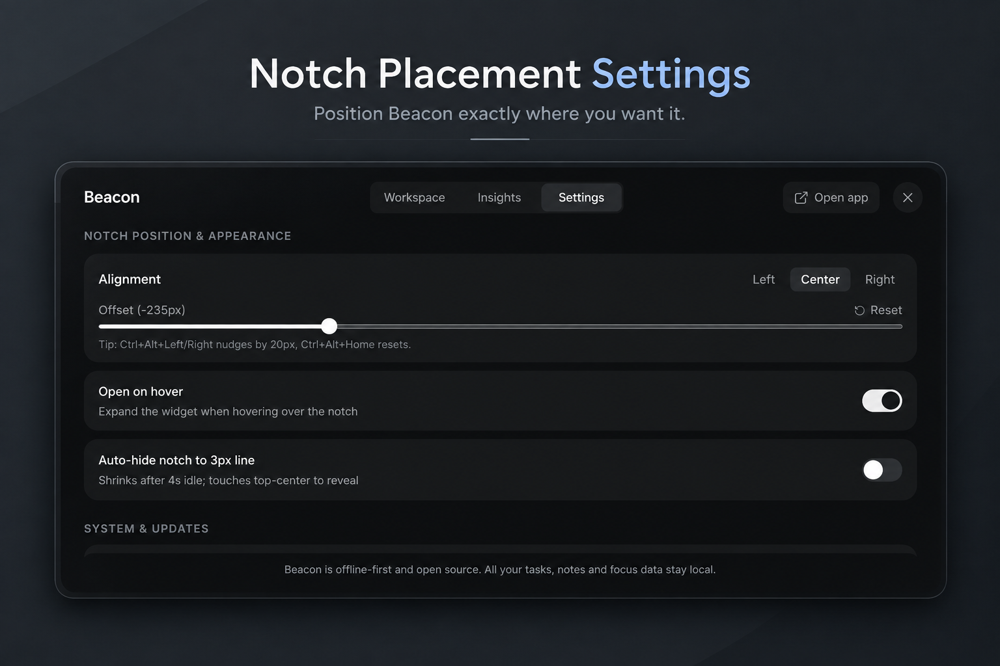
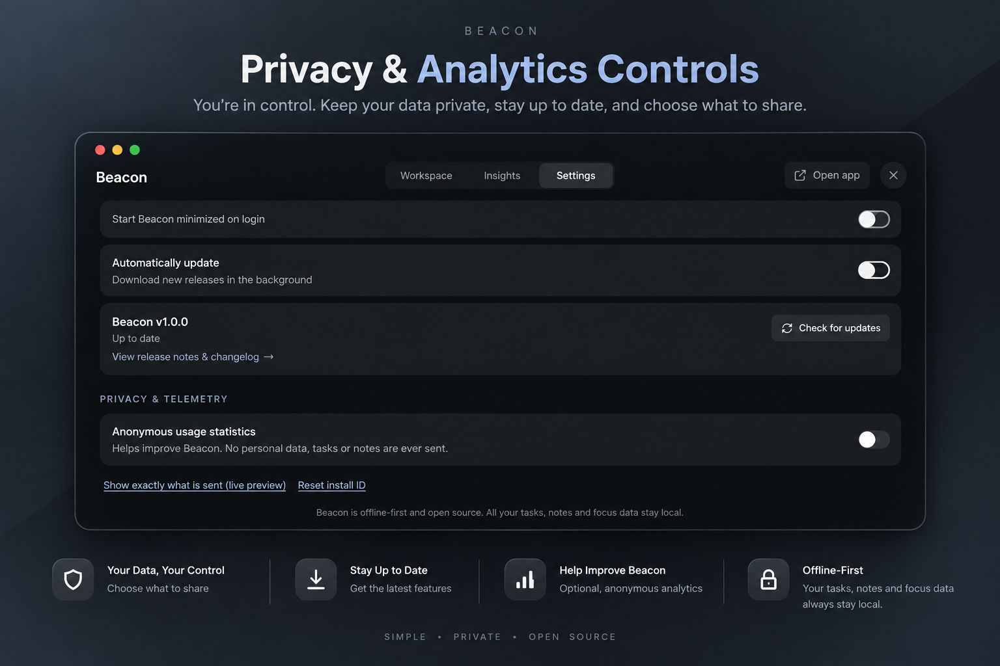

<div align="center">
  
  <h1>Beacon</h1>
  <p><b>Glanceable, low-distraction desktop focus notch & Pomodoro timer for Windows 10 and 11.</b></p>

  <p>
    <a href="https://github.com/kachakaran6/beacon/releases"></a>
    <a href="https://github.com/kachakaran6/beacon/releases"></a>
    <a href="https://github.com/kachakaran6/beacon/actions/workflows/ci.yml"></a>
    
    <a href="LICENSE"></a>
  </p>
</div>

---

## 🌟 Overview

**Beacon** is a minimalist, frameless desktop notch inspired by the Dynamic Island, engineered specifically for Windows 10 and 11. It anchors your current priority task, active Pomodoro session, and notes to the edge of your screen without stealing focus or interrupting your flow.

- **Stay anchored**: Keep your primary goal visible without opening heavy project management windows.
- **Configurable placement**: Dock anywhere along your screen (Left, Center, Right) across multiple monitors so it never obscures browser tabs or window controls.
- **Privacy-first & offline-ready**: 100% of your tasks, notes, and timers are stored locally on your machine.

---

## 📸 Screenshots

> [!NOTE]
> Screenshot assets are located under `docs/screenshots/`.

| Collapsed Pill | Expanded Workspace |
| :---: | :---: |
|  |  |

| Notch Placement Settings | Privacy & Analytics Controls |
| :---: | :---: |
|  |  |

---

## ✨ Features

- **Dynamic Collapsed Pill**: Sleek, glassmorphism notch displaying active task, dot-matrix timer, session progress ring, and playback controls.
- **Configurable Notch Placement**:
  - Segmented Left / Center / Right alignment with live fine-tuning offset sliders.
  - Multi-monitor aware: select any connected display by name or ID.
  - Automatic fallback to primary display when secondary monitors are disconnected.
- **Integrated Focus & Pomodoro Timer**:
  - Customizable focus (25m), short break (5m), and long break (15m) intervals.
  - Audio notifications and native Windows desktop alerts.
  - Session counter with automatic milestone tracking.
- **Fast Task Management**:
  - Inline task creation, editing, drag-and-drop reordering, priority tags, and estimates.
  - Dedicated completed section with one-click restore.
- **Productivity Workspace**:
  - Quick scratchpad / markdown notepad.
  - Daily & weekly focus analytics, streaks, and completion velocity.
- **Seamless System Integration**:
  - Global hotkeys for toggling expand/collapse, quick-add, timer controls, and position nudging.
  - Windows System Tray integration with quick controls.
  - Windows Startup autostart toggle (per-user registry run key).
  - Background auto-updater for seamless patch delivery.

---

## 📥 Installation

Download the latest release from the [GitHub Releases Page](https://github.com/kachakaran6/beacon/releases/latest).

### Options:
1. **Installer (`Beacon-Setup-1.0.0.exe`)**:
   - Standard per-user NSIS installer (no Administrator permissions required).
   - Installs to `%LOCALAPPDATA%\Programs\Beacon`.
   - Creates Start Menu and Desktop shortcuts.
   - Supports background auto-updating.
2. **Portable (`Beacon-1.0.0-portable.exe`)**:
   - Single standalone executable. Runs immediately without installation.

> [!IMPORTANT]
> **Windows SmartScreen Notice**: Because Beacon is an open-source community application without an expensive EV code-signing certificate, Windows SmartScreen may display an *"Unrecognized app"* warning on initial launch. Click **More info** &rarr; **Run anyway** to proceed.

> [!NOTE]
> **Legacy Migration**: If you previously used the experimental legacy preview, Beacon will automatically detect and migrate your saved tasks, notes, and settings on first launch. You may safely uninstall any previous versions from Windows Settings.

---

## ⌨️ Keyboard Shortcuts

| Shortcut | Action | Description |
| :--- | :--- | :--- |
| <kbd>Ctrl</kbd> + <kbd>Alt</kbd> + <kbd>Space</kbd> | **Toggle Expand / Collapse** | Expands the full workspace panel or collapses back to the notch |
| <kbd>Ctrl</kbd> + <kbd>Alt</kbd> + <kbd>N</kbd> | **Quick Add Task** | Focuses the task input inside the expanded widget |
| <kbd>Ctrl</kbd> + <kbd>Alt</kbd> + <kbd>P</kbd> | **Play / Pause Timer** | Starts or pauses the active Pomodoro session |
| <kbd>Ctrl</kbd> + <kbd>Alt</kbd> + <kbd>&larr;</kbd> | **Nudge Notch Left** | Moves the notch 20px to the left |
| <kbd>Ctrl</kbd> + <kbd>Alt</kbd> + <kbd>&rarr;</kbd> | **Nudge Notch Right** | Moves the notch 20px to the right |
| <kbd>Ctrl</kbd> + <kbd>Alt</kbd> + <kbd>Home</kbd> | **Reset Notch Position** | Re-centers the notch on the active display |

*(All global shortcuts can be customized under Settings > Shortcuts)*

---

## 🧭 Notch Position Guide

To ensure Beacon never covers your browser tabs or application headers:
1. Open the widget and navigate to **Settings &rarr; Appearance &rarr; Notch Position**.
2. Choose your preferred alignment: **Left**, **Center**, or **Right**.
3. Use the **Offset Slider** for pixel-precise fine-tuning. The notch is automatically clamped within your display bounds with safe margins.
4. Select your target monitor under the **Display** dropdown when using multi-monitor setups.
5. Hit **Reset Position** anytime to restore default top-center alignment.

---

## 🔒 Privacy & Anonymous Telemetry

Beacon is designed with strict privacy-by-default principles:

- **100% Local Data**: All tasks, subtasks, notes, estimates, history, and preferences are stored locally in `%APPDATA%\Beacon\store.json`. No personal data or user content ever leaves your machine.
- **Strictly Opt-in Anonymous Stats**:
  - On first run, Beacon prompts you with an optional choice to share basic anonymous telemetry.
  - **What is collected (only if opted in)**: A randomly generated installation UUID, event type (`install` or `launch`), app version (`1.0.0`), OS build tag (`win10` or `win11`), architecture (`x64`), and locale (`en-US`).
  - **What is NEVER collected**: Task names, note contents, usernames, hostnames, IP addresses, paths, or hardware IDs.
  - **Full transparency**: Under **Settings &rarr; Privacy**, view a live JSON preview of the exact payload sent, reset your installation ID, or revoke consent at any time.

Read the full [PRIVACY.md](PRIVACY.md) policy for detailed guarantees.

---

## 🔄 Automatic Updates

- **Installed Builds**: Automatically checks for updates on launch and every 6 hours in the background. When an update is ready, a clean in-panel toast allows you to restart immediately or apply automatically on quit.
- **Portable Builds**: Will notify you when a newer version is released on GitHub with a direct download link.

---

## 🛠️ Building From Source

### Prerequisites
- Node.js 20.x or higher
- npm 10.x or higher
- Windows 10/11 operating system

### Setup & Run
```bash
# Clone repository
git clone https://github.com/kachakaran6/beacon.git
cd beacon

# Install dependencies
npm install

# Start development dev server & Electron window
npm run app:dev
```

> [!NOTE]
> `npm run app:dev` runs `electron.exe`, so some Windows shell surfaces (like the Alt+Tab preview or taskbar) may still show the Electron icon during development. The packaged build (`npm run app:build`) shows the official monochrome Beacon icon everywhere.

### Testing & Validation
```bash
# Run Vitest unit & store tests
npm test

# Run code linter
npm run lint

# Verify brand consistency
npm run check:brand

# Build production installer and portable binary
npm run app:build
```

---

## 🚀 Release Process (Maintainers)

To cut and publish a new release:
```bash
# 1. Bump version and create commit + git tag
npm run release:patch   # or release:minor / release:major

# 2. Push tag to GitHub (triggers automated GitHub Actions release builder)
git push origin main --follow-tags
```

The GitHub Actions workflow will validate the version tag, run all test suites, compile the Windows binaries, and publish the release with `Beacon-Setup-<version>.exe`, `Beacon-<version>-portable.exe`, and update blockmaps.

---

## 🗺️ Roadmap

- [x] Configurable notch docking (Left / Center / Right / Offsets / Multi-monitor)
- [x] Privacy-first anonymous telemetry & telemetry worker
- [x] Automated background updates via GitHub Releases
- [ ] Customizable theme accents & custom sound packs
- [ ] Calendar integration (read-only ICS feed)
- [ ] Mini ambient sound generator (white noise, rain, cafe)

---

## 🤝 Contributing

Contributions are welcome! Please read [CONTRIBUTING.md](CONTRIBUTING.md) for local development workflows and pull request guidelines.

---

## 📄 License

Beacon is open-source software licensed under the [MIT License](LICENSE).
